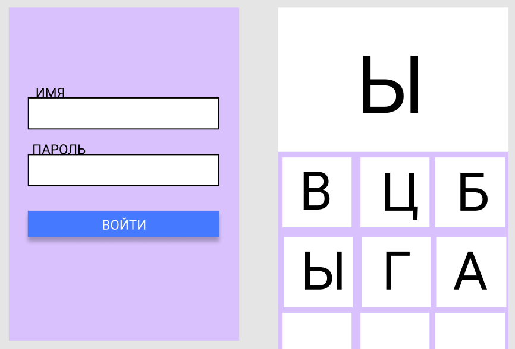

### Тестовое задание FULLSTACK-ПРОГРАММИСТ (УДАЛЕННО)

#### Задача:

Создать приложение-тренажёр для обучения русскому алфавиту.
Приложение должно работать в браузере Chrome и в любой из выбранных мобильных платформ как отдельное нативное приложение: Android или iOS (нужно чтобы приложение работало хотя бы в 1 из них).

У приложения должно быть 2 экрана:

###### Экран № 1

Экран № 1: авторизация с полями (имя и пароль) и кнопкой «Войти».
- Поле Имя принимает только русские буквы алфавита.
- Поле Пароль принимает только цифры.
- При нажатии на кнопку «Войти» если ввели не соответсвующие символы в то или иное поле нужно каким либо способом сообщить об этом пользователю. (например всплывающее окно или красный текст ошибки возле поля).
- Если все поля введены корректно, то должна выполняться связь с сервером приложения и проверить Имя и Пароль. Если комбинация полей корректная (присутсвует в БД приложения), то выполняется перенаправление на Экран № 2. Иначе выводится ошибка о некорректно имени или пароле (допускается выодв всплывающим окном или текстом).

Список пользователей приложения должен храниться в базе данных. При запуске приложения в нём должно создаваться 2 пользователя:
- Петя с паролем 655
- Ваня с паролем 350

###### Экран № 2

Экран № 2: на экране отображается случайная буква русского алфавита (загадываемая буква) чёрным текстом на белом фоне, и она может быть в верхнем или нижнем регистре. Регистр тоже подбирается случайно.
Снизу под буквой должны быть 32 кнопки (буквы алфавита) по 3 буквы на строку отсортированные в случайном порядке.
Регистр кнопоки зависит от показываемой буквы.
Если показываемая случайная буква находится в нижнем регистре, то все 32 кнопки (буквы алфавита) должны будут отображаться в нижнем регистре и наоборот.

- При нажатии на кнопку, которая соответсвует отображаемой букве фон кнопки должен смениться на зелёный и через 3 секунды должна появиться другая случайная буква и порядок кнопок алфавита должен в случайном порядке поменяться.

- Если была нажата кнопка не соответсвующая отображаемой букве, то фон кнопки должен смениться на красный, а цвет буквы на белый, и через 3 секунды цвета должны вернуться в исходное состояние.

- Каждое нажатие кнопки (правильное или неправильное) должно регистрироваться в базе данных, чтобы потом можно было проверить сколько правильных и неправильных ответов дал Петя или Ваня.

- Логика сортировки букв и правильного ответа должна быть реализована на сервере.

####  Эскиз приложения (Экран № 1 и Экран № 2):

#### Критерии выполнения задания:

1. Выполненное задание должно быть доступно в github профиле как отдельный репозиторий, который можно склонировать.
   Допускается github или gitlab или любой другой git-репозиторий кода. Главное чтобы была возможность выполнить git clone URI.

2. Задание должно быть размещёно в одной папке, назовём её корень /
   Т.е выполнили git clone URI ./project && cd ./project и получаем корень.

В проекте должны быть папки:

- /api — это приложение на сервере
- /web — это логика для запуска приложения в браузере (например /web/index.html)
- /android — это исходный код приложения для запуска в android-studio
- /ios — это исходный код приложения для запуска в xcode
- /README.md — инструкции по запуску и настройки приложения
- /docker-compose.yaml (необязательно)
- /dockerfiles (необязательно)
- /anyscript.sh (необязательно, любой bash-скрипт)

/android или /ios — одно из двух или оба или вместо них допускается папка /flutter

Наличие в папке других доп. файлов допускается.

3. Логика приложения должна находится на сервере.
- Проверка логина и пароля.
- Алгоритм сортировки кнопок-букв и вывод загадываемой буквы.

4. Приложение в браузере не должно выдавать JS-ошибок и не должно блокироваться в случае появления таких ошибок. (при условии работы доступности и корректной работы сервера)

5. Приложение не должно вылетать и блокировать работу с ним на мобильной платформе (android или ios) (при условии работы доступности и корректной работы сервера).

6. Приложение должно засчитывать корректное число правильных или неправильных ответов. Например двойное (множественное) нажатие на кнопку не должно увеличивать счётчик ответа.

#### Ограничения на выполнение задания:
- допустимые языки программирования серверной и клиентской логики: php5+, kotlin1.5+, java7+, dart2+, swift4+
- допустимые технологии для веб-сервера: веб-сервер nginx или apache, любой протокол взаимодействия приложения с веб-сервером (fastcgi, cgi, proxy)
- допустимые технологии для сервера базы данных: postgres или mysql
- протокол обмена между клиентом и сервером: http.
- формат обмена между клиентом и сервером: json.
- допустимые технологии автоматической настройки локального окружения: git, docker, docker-compose, bash-скрипты, ansible.
- в браузере допускается использование любых javascript-фреймворков.
- не допускается использовать React native и Apache cordova и любую технологию на базе webview для мобильной версии приложения.
- допускается использовать flutter (без webview), native android sdk, native ios sdk и любые фреймворки библиотеки в них, кроме webview-технологий.